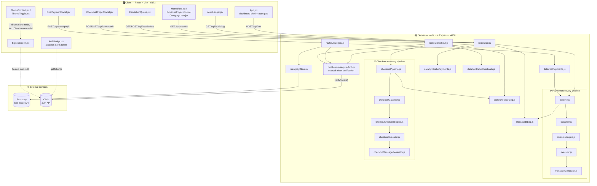
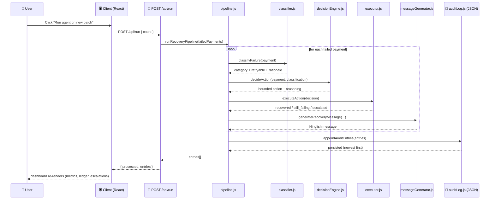
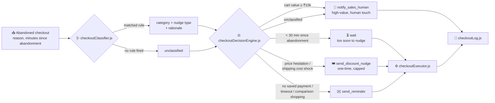
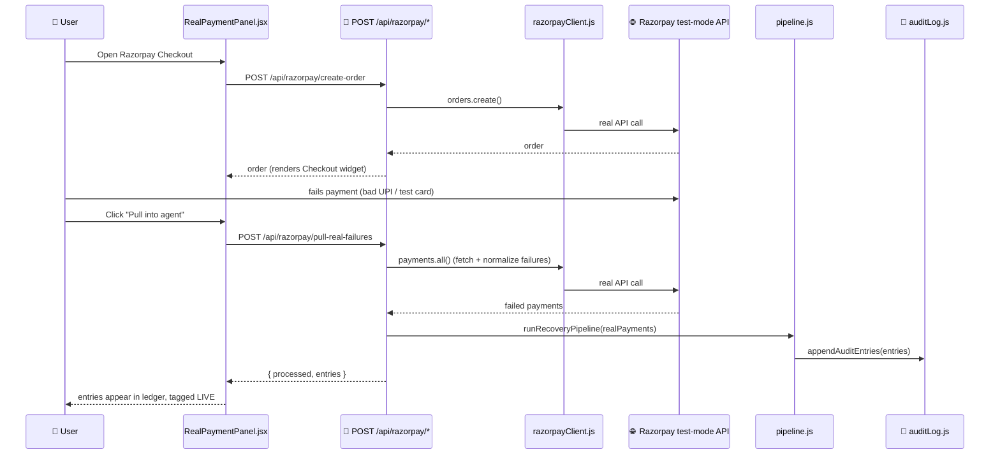
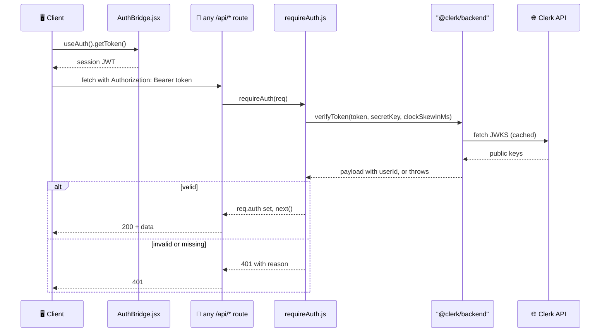
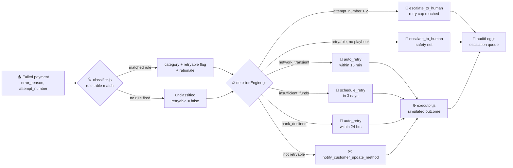

# 💳 PayMend — AI Revenue Recovery Agent

**Built for the Razorpay Buildathon — Track 03: AI Revenue Recovery**

> *PayMend* — pay + mend. An agent that watches failed payments and
> abandoned checkouts, figures out why each one happened, and takes one
> bounded, explainable action to win the revenue back — with a full audit
> trail and a human always in the loop for anything it can't safely
> resolve on its own.

Everything here runs for free: no paid APIs required, no database, no real
money moved. Diagnosis and decisioning are rule-based by design — for a
finance-adjacent agent, an auditable rule table beats an opaque model call
every time.

---

## 🧩 The problem

> *"Build an agent that detects revenue at risk, determines the right
> intervention, and executes a bounded recovery workflow: from payment
> failures and checkout abandonment to overdue receivables."* — Track 03 brief

Revenue loss rarely happens in one clean step. A card expires, a bank
declines a charge, a customer abandons checkout before paying at all — and
without something watching, that revenue just quietly disappears. Most
teams handle this manually, inconsistently, or not at all.

## 🔁 The approach

Two independent recovery pipelines, same five-stage architecture:

```
failed payment / abandoned checkout  →  classify()  →  decideAction()  →  executeAction()  →  audit log
            (detect)                      (diagnose)      (decide)            (act)
```

- 🔍 **Detect** — synthetic events shaped exactly like Razorpay's real
  `payment.failed` webhook payload, plus a genuine integration with
  Razorpay's test-mode API for real data (see below).
- 🩺 **Diagnose** — a fixed, readable rule table maps each case to a
  category. No black box: every classification carries the rule that fired.
- ⚖️ **Decide** — picks exactly one bounded action. Payments get a hard cap
  of 2 automatic retries, ever. Checkouts get a "too soon to nudge" wait
  state and a one-time-only discount cap. Anything outside the known rules
  goes to a human — the agent never guesses past what it has a rule for.
- ⚙️ **Act** — simulates the recovery action and generates a ready-to-send
  **Hinglish reminder message** where a customer nudge makes sense.
- 📝 **Log** — every step is written to an audit trail with the reasoning
  attached, in plain language, exportable as CSV.

---

## 🏗️ Architecture

PayMend is a two-tier app: a React/Vite SPA talking to an Express REST API,
gated behind real authentication, which runs everything through two
parallel rule-based pipelines and persists results to append-only JSON
audit logs. No database, no queue — designed to run for free on a laptop.



### 🔄 Request flow — "Run agent on new batch"



### 🛒 Checkout drop-off flow — a genuinely separate pipeline



No charge was ever attempted here, so this isn't a relabeled copy of the
payment pipeline — it has its own reasons, its own bounded actions (note
the wait state: the agent deliberately does *not* nudge someone who
abandoned a cart 5 minutes ago), and its own audit log.

### 💸 Real Razorpay test-mode flow



### 🔐 Auth flow — server-enforced, not just hidden client-side



Token verification is done directly with `@clerk/backend`'s `verifyToken()`
rather than through `@clerk/express`'s `clerkMiddleware()` + `getAuth()`
pairing — that approach proved unreliable in testing (an ordering error
even when correctly registered first). Manual, per-request verification
has no ordering to get wrong. `clockSkewInMs` tolerance is set to 30s to
absorb normal system clock drift without weakening the check.

### 🎯 Payment pipeline internals — bounded decision logic



**Reading the diagrams:**

- 🧭 **Component diagram** — the client never talks to Razorpay, Clerk, or
  the file stores directly; every path goes through the Express layer, so
  the audit logs are the single source of truth for both synthetic and
  real data, and every route is auth-gated before it does anything.
- 🔂 **Run-agent sequence** — one HTTP request fans out into N pipeline
  runs, each passing through all five engine stages before a single
  batched write to the JSON store.
- 🛒 **Checkout flowchart** — a fully independent funnel with its own
  bounded rules, including a deliberate "don't nudge yet" state.
- 💳 **Real Razorpay sequence** — genuinely hits Razorpay's test-mode API
  (`orders.create`, `payments.all`); only the *outcome simulation* inside
  `executor.js` stays mocked, since retrying a real charge isn't in scope.
- 🔐 **Auth sequence** — shows exactly why token verification is manual
  rather than middleware-based, and why a 30s clock skew tolerance exists.
- 🛡️ **Payment decision flowchart** — the "bounded and gated" contract made
  literal: every branch terminates in a concrete action or a human
  escalation, never an indefinite retry or an unguessed classification.

### 🛠️ Tech stack by layer

| Layer | Tech | Responsibility |
|---|---|---|
| 🖥️ Client | React 18 + Vite 5, Recharts | Dashboard UI, metrics charts, ledger, escalation queue, CSV export |
| 🔌 API | Node.js + Express 4 | REST endpoints, request validation, CORS |
| ⚙️ Engine | Plain JS modules (no framework) | classify → decide → act → message, pure functions, unit-testable |
| 💾 Persistence | JSON files (`server/.data/*.json`) | Append-only audit trails; only mutation path is escalation resolution |
| 🌐 Payments | `razorpay` SDK (official) | Test-mode order creation + real failed-payment fetch |
| 🆔 Auth | `@clerk/backend`, `@clerk/react`, `@clerk/themes` | Server-side token verification, client sign-in UI, themed Clerk modal |
| 🆔 IDs | `nanoid` | Audit entry IDs |

---

## ✨ Features

- 📊 **Live dashboard** — recovery rate, revenue recovered, and a
  failure-cause breakdown, styled to match Razorpay's own product design.
- 📈 **Revenue impact projection** — turns one batch into a monthly/annual
  number, with the extrapolation assumption stated plainly rather than
  hidden.
- 🙋 **Escalation queue** — a human-in-the-loop panel for anything the
  agent bounded out on. Approve a manual retry, dismiss, or write it off —
  every resolution logs back into the audit trail.
- 🛒 **Checkout drop-off recovery** — a second, independently-built
  recovery funnel for customers who never attempted to pay at all.
- 💬 **Hinglish recovery messages** — a ready-to-send customer message
  generated per failure type, with a one-click copy button.
- 📤 **Exportable audit trail** — full ledger as CSV, including human
  resolutions and generated messages.
- 💳 **Real Razorpay test-mode integration** — trigger an actual payment
  failure through Razorpay's own Checkout widget, then pull it through the
  exact same pipeline as everything else.
- 🔐 **Real authentication (Clerk)** — the dashboard requires a signed-in
  user, enforced server-side on every route, not just hidden client-side.
- 🌙 **Dark mode, everywhere** — including the pre-sign-in screen and
  Clerk's own modal, not just the dashboard.

## 🏆 Why this holds up against the track's own bar

> *"Don't just identify the problem. Show measured money recovered across a
> batch, with compliant escalation, stopping rules, and an audit trail."*
> — Track 03 bar

- 📏 **Measured money recovered across a batch** — live recovery rate,
  revenue recovered, and a monthly/annual projection, computed from an
  actual run, not hardcoded.
- 🙋 **Compliant escalation** — the escalation queue is a real workflow: a
  human approves a manual retry, dismisses, or writes off, and that
  decision is permanently logged, not just a status label.
- 🔒 **Stopping rules** — a hard-coded retry cap (2 attempts, no
  exceptions), a "too soon to nudge" wait state, and a one-time discount
  cap that can't be re-triggered.
- 📝 **Audit trail** — every decision logged with its reasoning in plain
  language, exportable as CSV. Tested against a **real** unexpected
  Razorpay failure ("international cards not supported") and correctly
  fell through to the safety-net rule instead of misclassifying it.

## 🚀 Setup (free, ~5 minutes)

### 1️⃣ Backend

```bash
cd server
npm install
cp .env.example .env
npm run dev
```

Runs on `http://localhost:4000`. Leave `USE_SYNTHETIC_DATA=true` and no
`CLERK_SECRET_KEY` set to run entirely open, on generated data — no
Razorpay or Clerk account needed to demo.

### 2️⃣ Frontend

```bash
cd client
npm install
npm run dev
```

Runs on `http://localhost:5173` and proxies `/api` to the backend.

### 3️⃣ Demo it

Open `http://localhost:5173`, click **Run agent on new batch**. Watch the
metrics populate, open the **Escalation queue** to resolve a bounded-out
payment, expand a ledger row's **Hinglish reminder** message, and scroll
down to run **Checkout drop-off recovery** separately.

## 🎤 What to show judges

1. Run the agent, watch the recovery rate and revenue-recovered numbers
   populate live.
2. Open the escalation queue and resolve one entry — stopping rules and
   human-in-the-loop design made literal, not just claimed.
3. Expand a Hinglish reminder message on any ledger row.
4. Scroll to Checkout Drop-off Recovery — a second, independently-built
   funnel with its own rules, not a relabeled copy.
5. The rule tables in `classifier.js` / `checkoutClassifier.js` and
   `decisionEngine.js` / `checkoutDecisionEngine.js` — readable top to
   bottom in under a minute, which is the point.
6. The real Razorpay integration — trigger and pull in a genuine test-mode
   failure to prove this isn't only running on synthetic data.

## 💳 Using real Razorpay test-mode data (optional, still free)

The dashboard includes a **"Real Razorpay test-mode data"** panel that lets
you generate an actual failed payment through Razorpay's own Checkout, then
feed it through the exact same pipeline as synthetic data — no code changes
needed.

1. Create a free account at https://dashboard.razorpay.com/ and switch to
   **Test Mode** (toggle top-left). No KYC or payment info required.
2. Settings → API Keys → generate a **Test** key pair, drop into
   `server/.env`:
   ```
   RAZORPAY_KEY_ID=rzp_test_...
   RAZORPAY_KEY_SECRET=...
   ```
3. Restart the backend so it picks up the keys.
4. Click **Open Razorpay Checkout**. Fastest way to fail it: choose UPI,
   enter `failure@razorpay` as the UPI ID — instant decline, no card
   needed. Or use a [test card](https://razorpay.com/docs/payments/payments/test-card-details/)
   and either enter a sub-4-digit OTP or let Razorpay itself reject it.
5. Click **Pull into agent** — calls Razorpay's real Payments API,
   classifies the failure, runs it through the same pipeline as everything
   else. Shows up in the ledger tagged **LIVE**.

## 🔐 Real authentication (optional, free)

By default there's no sign-in gate. To require a real signed-in user, both
in the UI and enforced server-side on every route:

1. Create a free account at https://clerk.com and create an application.
2. From **API Keys**, copy both keys into `server/.env`:
   ```
   CLERK_SECRET_KEY=sk_test_...
   CLERK_PUBLISHABLE_KEY=pk_test_...
   ```
3. And the publishable key into `client/.env`:
   ```
   VITE_CLERK_PUBLISHABLE_KEY=pk_test_...
   ```
   **This must be the exact same key** as `CLERK_PUBLISHABLE_KEY` in
   `server/.env` — keys from two different Clerk apps will silently fail
   token verification.
4. Restart both. Every `/api` route now returns `401` without a valid
   session.

## 📁 Project structure

```
paymend/
├── server/
│   ├── src/
│   │   ├── data/
│   │   │   ├── syntheticPayments.js      # synthetic failed-payment generator
│   │   │   ├── realPayments.js           # fetches + normalizes real Razorpay failures
│   │   │   └── syntheticCheckouts.js     # synthetic abandoned-checkout generator
│   │   ├── engine/
│   │   │   ├── classifier.js             # payment diagnosis rules
│   │   │   ├── decisionEngine.js         # payment bounded decision rules
│   │   │   ├── executor.js               # payment simulated execution
│   │   │   ├── messageGenerator.js       # Hinglish payment recovery messages
│   │   │   ├── pipeline.js               # payment pipeline orchestrator
│   │   │   ├── checkoutClassifier.js     # checkout abandonment diagnosis rules
│   │   │   ├── checkoutDecisionEngine.js # checkout bounded decision rules
│   │   │   ├── checkoutExecutor.js       # checkout simulated execution
│   │   │   ├── checkoutMessageGenerator.js # Hinglish checkout nudge messages
│   │   │   └── checkoutPipeline.js       # checkout pipeline orchestrator
│   │   ├── store/
│   │   │   ├── auditLog.js               # payment audit log + escalation resolution
│   │   │   └── checkoutLog.js            # checkout audit log
│   │   ├── routes/
│   │   │   ├── api.js                    # payment REST endpoints
│   │   │   ├── razorpay.js               # real Razorpay test-mode endpoints
│   │   │   └── checkout.js               # checkout drop-off REST endpoints
│   │   ├── middleware/requireAuth.js     # manual Clerk token verification
│   │   ├── razorpayClient.js             # Razorpay SDK instantiation
│   │   ├── clerkConfig.js                # Clerk configured-or-not check
│   │   └── index.js                      # Express app
│   └── .env.example
└── client/
    └── src/
        ├── App.jsx                          # auth gate + main dashboard
        ├── main.jsx                         # ThemeProvider + conditional ClerkProvider
        ├── lib/
        │   ├── csvExport.js                 # audit log -> CSV
        │   ├── apiClient.js                 # fetch wrapper, attaches auth token
        │   ├── apiBase.js                   # API base URL (dev proxy vs deployed)
        │   ├── clerkConfig.js               # Clerk enabled/key check
        │   └── ThemeContext.jsx             # app-wide theme, incl. Clerk's own modal
        └── components/
            ├── MetricRow.jsx
            ├── RevenueProjection.jsx        # monthly/annual impact panel
            ├── CategoryChart.jsx
            ├── EscalationQueue.jsx          # human-in-the-loop resolution
            ├── RealPaymentPanel.jsx         # real Checkout trigger + pull-in
            ├── AuditLedger.jsx              # ledger UI, messages, CSV export
            ├── CheckoutDropoffPanel.jsx     # checkout drop-off dashboard + ledger
            ├── AuthBridge.jsx               # wires Clerk token into apiClient
            ├── SignInScreen.jsx             # sign-in gate UI
            └── ThemeToggle.jsx              # shared light/dark toggle
```
